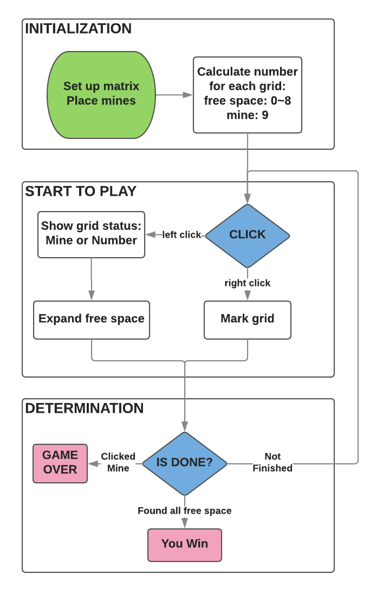
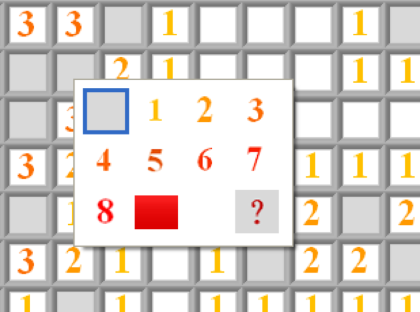
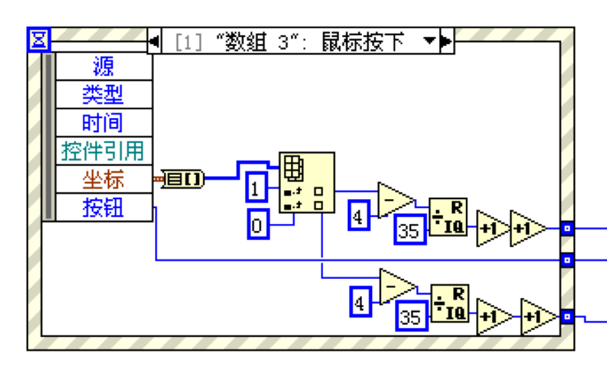
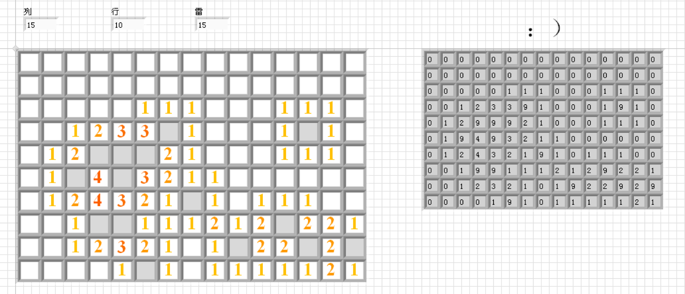

# Minesweeper_LabView
***Minesweeper*** is a classic and interesting game, famous in late twentieth century. This repo is a minesweeper program written in ***LabView***, which is a development environment for a visual programming language from National Instruments, providing a convenient way to develop an platform integrating all kinds of output data from equipments.
This program was written when I was back in college, to get familiar with varied functions in LabView. The GUI kit in LabView is easy to get started, which makes it possible and simple to write some games in LabView. Minesweeper does not required fancy algorithms but just basic matrix and be acquaint with modules in LabView. There is a **demo** .

## Structure of Minesweeper

* **TIPS**
  * The entries in a ____ could be repalce by **pictures**.
  
  * **CLICK** there is acutally not really click on the grids, but directly on the screen and convert the coordinate to the index of the ____matrix.
    

*After you know the solution, minesweeper losts its charms.*

